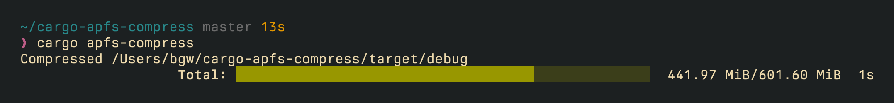

# cargo-apfs-compress

[](https://crates.io/crates/cargo-apfs-compress)

> [!WARNING]
> This project is vibe-coded. Use it at your own risk.

A CLI to compress Cargo target artifacts with [APFS compression] on macOS using
[`applesauce`].



[APFS compression]: https://en.wikipedia.org/wiki/Apple_File_System#Compression
[`applesauce`]: https://github.com/Dr-Emann/applesauce

## Install

```bash
cargo install cargo-apfs-compress
```

## Use

From a Cargo project directory, run:

```bash
cargo apfs-compress --help
cargo apfs-compress
```

By default, `cargo apfs-compress` will find all profiles within `target`, lock
them, and recursively compress the contents of every file within using the
[LZFSE] algorithm. Files that are already compressed are skipped.

> [!NOTE]
> Newly created or updated files are not automatically compressed by APFS, so
> you may need to re-run compression periodically after new builds.

[LZFSE]: https://en.wikipedia.org/wiki/LZFSE

## What? Why?

APFS compression stores file data in a compressed form while keeping normal file
access semantics, so build outputs can take much less disk space without
changing your Cargo workflow.

Rust `target/` directories are often large and full of binaries, rlibs, and
other artifacts that are usually very compressible. This tool usually compresses
`target/` directories to less than half their normal size.

## Locking and Safety

To avoid corrupting the `target` directory, this first acquires the target's
lockfile (`target/**/.cargo-lock`), and uses `applesauce`'s atomic updates using
temporary files and renames to ensure safety.

## Other Platforms

This project is macOS-only.

On Linux, consider a filesystem with transparent compression support, such as
[btrfs].

On Windows, [ReFS provides volume-level compression][windows-refs]. The Windows
[Dev Drive] feature provides a convenient way to create a ReFS volume.

[btrfs]: https://btrfs.readthedocs.io/en/latest/Compression.html
[windows-refs]: https://learn.microsoft.com/en-us/windows-server/administration/windows-commands/refsutil-compression
[Dev Drive]: https://learn.microsoft.com/en-us/windows/dev-drive/

## License

This project is licensed under the GPLv3+ license as it depends on
[`applesauce`], which is GPLv3+.

This project contains vendored file locking code derived from `cargo`, which is
licensed under the MIT and Apache 2.0 licenses. The content of `src/flock.rs`
retains the MIT and Apache 2.0 licenses, and is not GPLv3+ licensed.
